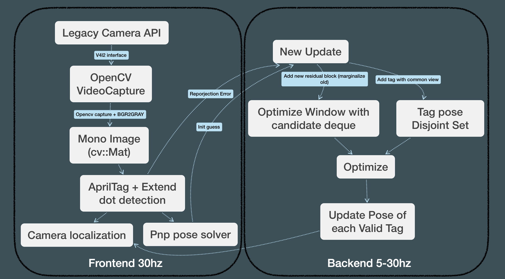

# apriltaglocal\_deploy

## Frame work




## Environment

### Ros Noetic

### Dependency Required

- AprilTag
- Yaml-cpp
- Glog
- Ceres
- Opencv4
- Eigen3

#### Install with `apt-get`

```shell
sudo apt install -y libyaml-cpp-dev libgoogle-glog-dev libeigen3-dev libceres-dev
sudo apt install -y libopencv-dev git cmake
mkdir 3rdparty && cd 3rdparty
git clone https://github.com/AprilRobotics/apriltag && cd apriltag
cmake -B build -DCMAKE_BUILD_TYPE=Release
sudo cmake --build build --target install
```

### Catkin build instruction

```shell
cd ${catkin_ws}/src
git clone https://github.com/sjtuyuxuan/ExtendAprilTagLocal
cd .. && catkin_make
```

## How to run

`rosrun extend_april_local localization`

## Sample


## Test

### Check whether camera is working

   Use rqt to check wether ros camera is working

### Simulate Test with bag

bag is in [link]([bag - Google Drive](https://drive.google.com/drive/folders/1Xrv_PtHaB-Tt48jMuk3dzoAkk-koU0hy))

```shell
rosrun extend_april_local localization
```

```shell
rosbag play test.bag
```

```shell
rviz
```

### Camera calibration

You need to calibrate the camera manually. Ros `camera calibration` maybe a good choice. 

You need to get  $f_x$  $f_y$  $c_x$ $c_y$ for intrinsic and  $k_1$  $k_2$  $p_1$  $p_2$ $(k_3)$  for distortion coefficients. Tipically you should not use camera with high distortion.

### Output check

see whether the tf tree work in rviz
